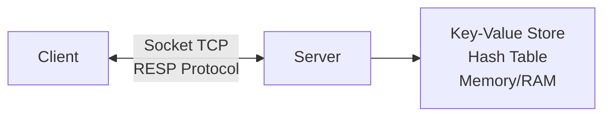
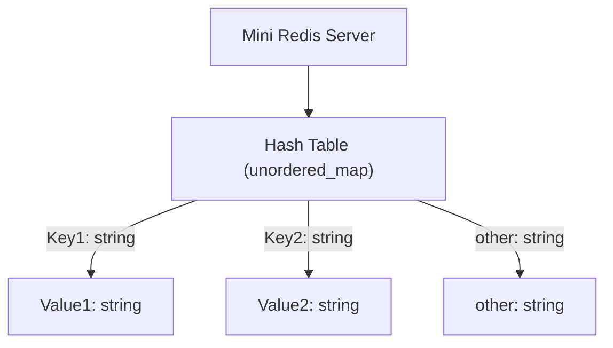
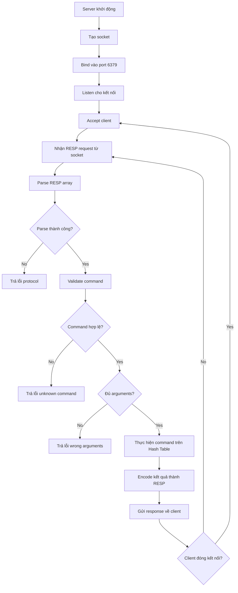
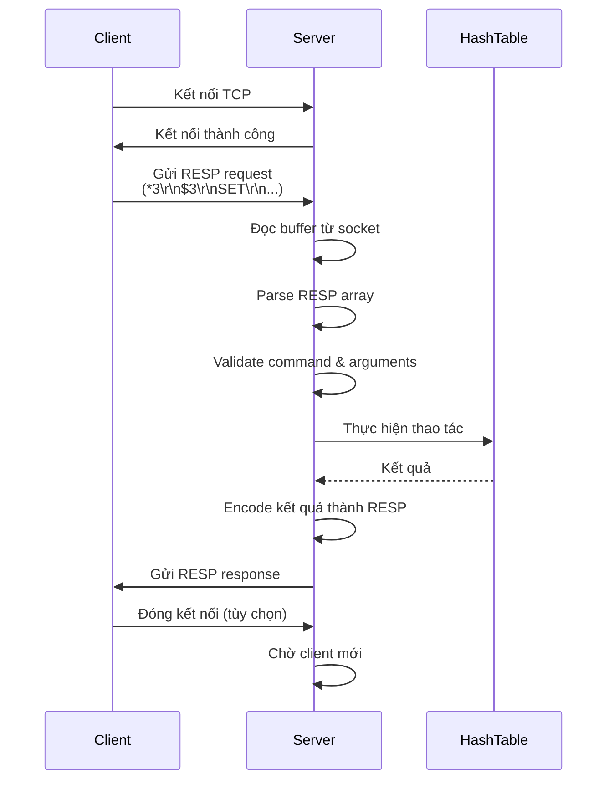
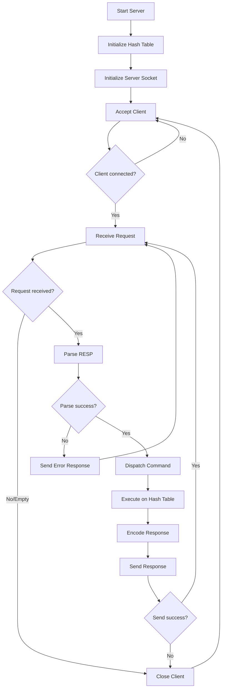
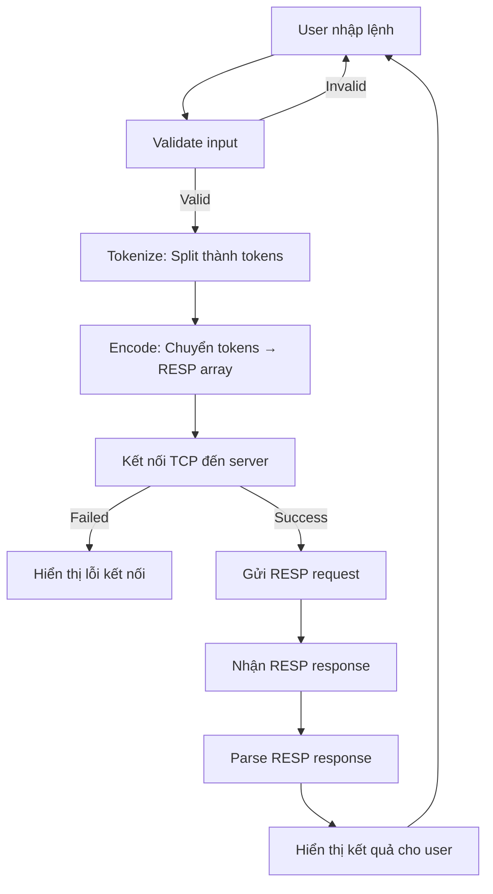
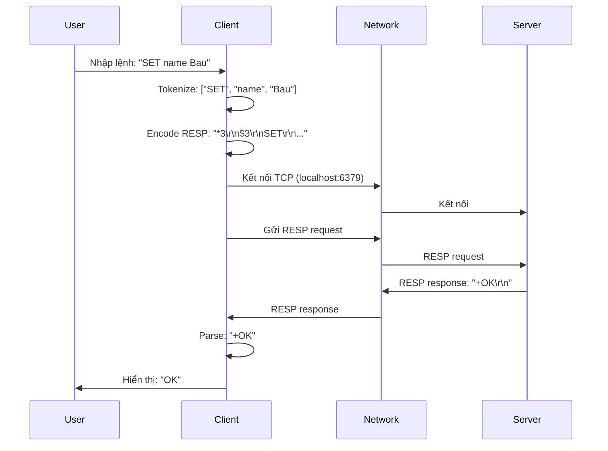

# Mini-redis
this is a small project made by ArduinoBK

# 0. Kiến thức cơ bản

## Giải thích các khái niệm

### **Client (Máy khách)**
**Client** là chương trình hoặc ứng dụng gửi yêu cầu đến một server để nhận dịch vụ hoặc dữ liệu. Trong dự án này:
- Client là chương trình với giao diện dòng lệnh (CLI) mà bạn viết
- Client nhận lệnh từ người dùng (ví dụ: `SET name Bau`)
- Client gửi lệnh này đến server qua mạng
- Client nhận kết quả từ server và hiển thị cho người dùng

**Ví dụ thực tế:** Khi bạn mở trình duyệt và truy cập Google, trình duyệt của bạn đóng vai trò là client, còn máy chủ Google là server.

---

### **Server (Máy chủ)**
**Server** là chương trình chạy trên một máy tính, lắng nghe và xử lý các yêu cầu từ client. Trong dự án này:
- Server là chương trình Mini Redis mà bạn xây dựng
- Server lưu trữ dữ liệu (key-value pairs) trong bộ nhớ
- Server nhận lệnh từ client, xử lý và trả kết quả về
- Server chạy liên tục, chờ đợi các kết nối từ client

**Ví dụ thực tế:** Máy chủ web lưu trữ website, máy chủ email xử lý email, máy chủ game xử lý trò chơi trực tuyến.

---

### **Socket**
**Socket** là điểm cuối (endpoint) của kết nối mạng giữa hai chương trình. Nó giống như một "ổ cắm điện" cho giao tiếp mạng:
- **Server socket:** Tạo ra một "cổng" (port) để lắng nghe kết nối từ client
- **Client socket:** Kết nối đến server qua địa chỉ IP và port
- Socket cho phép hai chương trình trên các máy tính khác nhau (hoặc cùng máy) trao đổi dữ liệu

**Quy trình:**
1. Server tạo socket → bind vào port (ví dụ: 6379) → listen → accept
2. Client tạo socket → connect đến server
3. Cả hai bên có thể gửi/nhận dữ liệu qua socket này

**Ví dụ:** Giống như khi bạn gọi điện thoại - bạn cần số điện thoại (địa chỉ IP + port) và kết nối được thiết lập (socket).

---

### **Protocol (Giao thức)**
**Protocol** là bộ quy tắc và định dạng mà client và server phải tuân theo để giao tiếp với nhau. Giống như ngôn ngữ chung:
- Cả client và server phải "nói cùng một ngôn ngữ"
- Protocol định nghĩa cách mã hóa dữ liệu, cách gửi/nhận, cách xử lý lỗi

**Ví dụ các protocol phổ biến:**
- **HTTP:** Giao thức cho web (trình duyệt ↔ máy chủ web)
- **TCP:** Giao thức truyền tải đáng tin cậy (dùng trong dự án này)
- **RESP:** Giao thức của Redis (dùng trong dự án này)

**Tại sao cần protocol?** Nếu không có protocol, client gửi "SET name Bau" nhưng server không biết cách hiểu → cần định dạng chuẩn (RESP).

---

### **Memory (Bộ nhớ)**
**Memory** (RAM - Random Access Memory) là nơi lưu trữ dữ liệu tạm thời khi chương trình đang chạy:
- Dữ liệu trong memory **mất đi** khi tắt chương trình (khác với ổ cứng)
- Truy cập memory **rất nhanh** (nhanh hơn đọc/ghi ổ cứng hàng trăm lần)
- Trong dự án này, bạn dùng **hash table** lưu trong memory để lưu key-value pairs

**Ví dụ trong code:**
```cpp
std::unordered_map<string, string> store;  // Lưu trong RAM
store["name"] = "Bau";  // Lưu vào memory
```

**Lưu ý:** Khi server tắt, tất cả dữ liệu trong memory sẽ mất. Để lưu vĩnh viễn, cần ghi vào ổ cứng (file hoặc database).

---

### **Key-Value Store (Kho lưu trữ dạng khóa-giá trị)**
**Key-Value Store** là cách lưu trữ dữ liệu đơn giản nhất:
- Mỗi dữ liệu có một **key** (khóa) duy nhất
- Mỗi key ánh xạ đến một **value** (giá trị)
- Giống như từ điển: tra từ (key) → nghĩa (value)

**Ví dụ:**
```
Key: "name"     → Value: "Bau"
Key: "age"      → Value: "20"
Key: "city"     → Value: "Hanoi"
```

**Cấu trúc dữ liệu:** Hash table (bảng băm) là cách triển khai phổ biến:
- Tìm kiếm, thêm, xóa rất nhanh: O(1) trung bình
- Trong C++: `std::unordered_map<string, string>`

**Ứng dụng:** Redis, Memcached, DynamoDB đều là key-value stores.

---

### **Redis**
**Redis** (Remote Dictionary Server) là một hệ thống lưu trữ key-value nổi tiếng:
- **In-memory:** Lưu dữ liệu trong RAM → tốc độ cực nhanh
- **Key-value store:** Lưu dữ liệu dạng key-value
- **Networked:** Client kết nối qua mạng (TCP)
- **Protocol:** Sử dụng RESP để giao tiếp

**Tại sao Redis nhanh?**
- Dữ liệu trong RAM (không phải ổ cứng)
- Cấu trúc dữ liệu tối ưu (hash table)
- Đơn giản, không phức tạp như database quan hệ

**Dự án này:** Bạn đang xây dựng một "Mini Redis" - phiên bản đơn giản hóa của Redis, chỉ hỗ trợ 4 lệnh cơ bản.

---

### **RESP (Redis Serialization Protocol)**
**RESP** là giao thức mà Redis dùng để client và server giao tiếp. Nó định nghĩa cách mã hóa dữ liệu thành chuỗi text để gửi qua mạng.

**RESP có 5 loại dữ liệu:**

| Loại | Prefix | Ví dụ | Ý nghĩa |
|------|--------|-------|---------|
| **Simple String** | `+` | `+OK\r\n` | Thông báo thành công |
| **Error** | `-` | `-ERR key not found\r\n` | Thông báo lỗi |
| **Integer** | `:` | `:1\r\n` | Số nguyên |
| **Bulk String** | `$` | `$5\r\nHello\r\n` | Chuỗi có độ dài cố định |
| **Array** | `*` | `*3\r\n$3\r\nSET\r\n...` | Mảng các phần tử |

**Quy tắc quan trọng:**
- Mỗi dòng kết thúc bằng `\r\n` (carriage return + line feed)
- Bulk string: `$<độ dài>\r\n<nội dung>\r\n`
- Array: `*<số phần tử>\r\n` + các phần tử tiếp theo

**Ví dụ lệnh `SET name Bau` được mã hóa thành RESP:**
```
*3\r\n          ← Mảng có 3 phần tử
$3\r\n         ← Phần tử 1: chuỗi dài 3 ký tự
SET\r\n        ← Nội dung "SET"
$4\r\n         ← Phần tử 2: chuỗi dài 4 ký tự
name\r\n       ← Nội dung "name"
$5\r\n         ← Phần tử 3: chuỗi dài 5 ký tự
Bau\r\n      ← Nội dung "Bau"
```

**Tại sao cần RESP?**
- Định dạng chuẩn, dễ parse (phân tích)
- Hỗ trợ nhiều kiểu dữ liệu
- Đơn giản, dễ implement
- Redis dùng RESP, nên client của bạn có thể kết nối với Redis thật
---

## **Tổng hợp: Cách các khái niệm kết nối với nhau**



**Luồng hoạt động:**
1. **Client** nhận lệnh từ người dùng: `SET name Bau`
2. **Client** mã hóa thành **RESP** format
3. **Client** gửi qua **Socket** (TCP) đến **Server**
4. **Server** nhận dữ liệu qua **Socket**
5. **Server** parse **RESP** để lấy lệnh
6. **Server** thực hiện lệnh trên **Key-Value Store** (lưu trong **Memory**)
7. **Server** mã hóa kết quả thành **RESP** và gửi về **Client**
8. **Client** parse **RESP** và hiển thị kết quả

---

# 🧱 PHẦN 1 — MINI REDIS SERVER

## 📋 Yêu cầu tổng quan

Xây dựng một server đơn giản mô phỏng Redis với các yêu cầu sau:

1. **Lưu trữ dữ liệu:** Sử dụng một hash table trong bộ nhớ để lưu trữ key-value pairs
2. **Giao tiếp mạng:** Lắng nghe và xử lý kết nối TCP từ client
3. **Protocol:** Tuân thủ RESP (Redis Serialization Protocol) để giao tiếp
4. **Commands:** Hỗ trợ 4 lệnh cơ bản: `SET`, `GET`, `DEL`, `EXISTS`
5. **Response:** Trả kết quả về client theo định dạng RESP

**Lưu ý:** Server chỉ xử lý **1 client tại 1 thời điểm** (đủ cho mục đích học tập).

---

## 1️⃣ CẤU TRÚC LƯU TRỮ

### Yêu cầu

Server cần một cấu trúc dữ liệu để lưu trữ key-value pairs trong bộ nhớ.

### Giải pháp

Sử dụng **hash table** (bảng băm) với các đặc điểm:

- **Cấu trúc dữ liệu:** `std::unordered_map<string, string>` (C++) hoặc tương đương
- **Key:** Chuỗi ký tự (string)
- **Value:** Chuỗi ký tự (string)
- **Độ phức tạp:** O(1) trung bình cho các thao tác tìm kiếm, thêm, xóa

### Ví dụ khai báo

```cpp
#include <unordered_map>
#include <string>

std::unordered_map<std::string, std::string> store;
```

### Kiến trúc lưu trữ



### Ví dụ dữ liệu

| Key      | Value    |
| -------- | -------- |
| `"name"` | `"Bau"` |
| `"age"`  | `"18"`   |
| `"city"` | `"Hanoi"` |

---

## 2️⃣ LUỒNG XỬ LÝ REQUEST TRONG SERVER

### Tổng quan

Server hoạt động theo mô hình **request-response** với vòng lặp vô hạn:

1. Server khởi động và lắng nghe kết nối
2. Client kết nối và gửi request
3. Server xử lý request và trả response
4. Lặp lại từ bước 2 (hoặc đóng kết nối và chờ client mới)

### Luồng xử lý chi tiết



### Sequence Diagram



---

## 3️⃣ CHI TIẾT TRIỂN KHAI TỪNG BƯỚC

### Bước 1: Khởi tạo Server

#### Yêu cầu

Tạo và cấu hình TCP socket server để lắng nghe kết nối từ client.

#### Input

- **Port:** 6379 (mặc định) hoặc có thể cấu hình
- **Address:** INADDR_ANY (lắng nghe trên tất cả interfaces)

#### Output

- **server_fd:** Socket descriptor của server (nếu thành công)
- **Error:** -1 nếu thất bại

#### Implementation

```cpp
#include <sys/socket.h>
#include <netinet/in.h>
#include <arpa/inet.h>
#include <unistd.h>

int initializeServer(int port) {
    // 1. Tạo socket
    int server_fd = socket(AF_INET, SOCK_STREAM, 0);
    if (server_fd < 0) {
        perror("socket failed");
        return -1;
    }
    
    // 2. Cấu hình socket options (tùy chọn: tái sử dụng address)
    int opt = 1;
    setsockopt(server_fd, SOL_SOCKET, SO_REUSEADDR, &opt, sizeof(opt));
    
    // 3. Cấu hình địa chỉ
    struct sockaddr_in address;
    address.sin_family = AF_INET;
    address.sin_addr.s_addr = INADDR_ANY;  // Lắng nghe trên tất cả interfaces
    address.sin_port = htons(port);
    
    // 4. Bind socket vào port
    if (bind(server_fd, (struct sockaddr *)&address, sizeof(address)) < 0) {
        perror("bind failed");
        close(server_fd);
        return -1;
    }
    
    // 5. Lắng nghe kết nối (backlog = 1 cho single client)
    if (listen(server_fd, 1) < 0) {
        perror("listen failed");
        close(server_fd);
        return -1;
    }
    
    printf("Server listening on port %d\n", port);
    return server_fd;
}
```

#### Error Handling

- **Socket creation failed:** Kiểm tra quyền truy cập và tài nguyên hệ thống
- **Bind failed:** Port có thể đã được sử dụng, thử port khác
- **Listen failed:** Lỗi hệ thống, kiểm tra logs

#### Task Checklist

- [ ] Tạo socket với `socket(AF_INET, SOCK_STREAM, 0)`
- [ ] Cấu hình `sockaddr_in` structure
- [ ] Bind socket vào port
- [ ] Listen cho kết nối
- [ ] Xử lý lỗi ở mỗi bước

---

### Bước 2: Chấp nhận kết nối từ Client

#### Yêu cầu

Chấp nhận kết nối TCP từ client và nhận socket descriptor để giao tiếp.

#### Input

- **server_fd:** Socket descriptor của server (từ bước 1)

#### Output

- **client_fd:** Socket descriptor của client (nếu thành công)
- **Error:** -1 nếu thất bại

#### Implementation

```cpp
int acceptClient(int server_fd) {
    struct sockaddr_in client_address;
    socklen_t client_addr_len = sizeof(client_address);
    
    printf("Waiting for client connection...\n");
    
    int client_fd = accept(server_fd, 
                          (struct sockaddr *)&client_address, 
                          &client_addr_len);
    
    if (client_fd < 0) {
        perror("accept failed");
        return -1;
    }
    
    char client_ip[INET_ADDRSTRLEN];
    inet_ntop(AF_INET, &client_address.sin_addr, client_ip, INET_ADDRSTRLEN);
    printf("Client connected from %s:%d\n", 
           client_ip, ntohs(client_address.sin_port));
    
    return client_fd;
}
```

#### Lưu ý

- Hàm `accept()` là **blocking** - sẽ chờ cho đến khi có client kết nối
- Chỉ xử lý 1 client tại 1 thời điểm trong phiên bản này

#### Task Checklist

- [ ] Gọi `accept()` trên server socket
- [ ] Lưu client socket descriptor
- [ ] In thông tin client (IP, port) để debug
- [ ] Xử lý lỗi accept

---

### Bước 3: Nhận dữ liệu từ Client

#### Yêu cầu

Đọc RESP request từ client qua socket.

#### Input

- **client_fd:** Socket descriptor của client
- **Buffer size:** Kích thước buffer để đọc (ví dụ: 1024 bytes)

#### Output

- **Buffer:** Chứa RESP raw text từ client
- **bytes_read:** Số bytes đã đọc (0 nếu client đóng kết nối, -1 nếu lỗi)

#### Implementation

```cpp
#include <string>

string receiveRequest(int client_fd) {
    char buffer[4096] = {0};
    int bytes_read = recv(client_fd, buffer, sizeof(buffer) - 1, 0);
    
    if (bytes_read < 0) {
        perror("recv failed");
        return "";
    }
    
    if (bytes_read == 0) {
        // Client đóng kết nối
        return "";
    }
    
    buffer[bytes_read] = '\0';
    return string(buffer);
}
```

#### Edge Cases

1. **Client đóng kết nối:** `recv()` trả về 0 → xử lý đóng kết nối
2. **Dữ liệu chưa đủ:** RESP request có thể được gửi nhiều lần, cần đọc đủ
3. **Buffer đầy:** Nếu request lớn hơn buffer, cần đọc nhiều lần

#### Strategy: Đọc đủ RESP message

RESP array có thể không đọc hết trong 1 lần. Cần đọc cho đến khi parse được đầy đủ:

```cpp
string receiveFullRequest(int client_fd) {
    string full_request = "";
    char buffer[1024];
    
    while (true) {
        int bytes_read = recv(client_fd, buffer, sizeof(buffer) - 1, 0);
        
        if (bytes_read <= 0) {
            break;
        }
        
        buffer[bytes_read] = '\0';
        full_request += string(buffer, bytes_read);
        
        // Kiểm tra xem đã đủ RESP message chưa
        // (Có thể parse thử để kiểm tra)
        if (isCompleteRESPMessage(full_request)) {
            break;
        }
    }
    
    return full_request;
}
```

#### Task Checklist

- [ ] Tạo buffer để đọc dữ liệu
- [ ] Gọi `recv()` để nhận dữ liệu
- [ ] Xử lý trường hợp client đóng kết nối (bytes_read == 0)
- [ ] Xử lý lỗi recv (bytes_read < 0)
- [ ] Đảm bảo đọc đủ RESP message (nếu cần)

---

### Bước 4: Parse RESP Request

#### Yêu cầu

Chuyển đổi RESP array string thành vector<string> để xử lý.

#### Input

- **RESP string:** Chuỗi RESP raw text, ví dụ: `"*3\r\n$3\r\nSET\r\n$4\r\nname\r\n$5\r\nBau\r\n"`

#### Output

- **Vector<string>:** Chứa command và arguments, ví dụ: `["SET", "name", "Bau"]`
- **Error:** Vector rỗng hoặc throw exception nếu parse lỗi

#### Implementation

```cpp
#include <vector>
#include <string>
#include <sstream>

vector<string> parseRESPArray(const string& resp) {
    vector<string> result;
    
    if (resp.empty() || resp[0] != '*') {
        throw "Invalid RESP array: must start with '*'";
    }
    
    size_t pos = 1;
    
    // 1. Đọc số lượng phần tử N
    size_t newline_pos = resp.find("\r\n", pos);
    if (newline_pos == string::npos) {
        throw "Invalid RESP array: missing \\r\\n after array count";
    }
    
    int n = stoi(resp.substr(pos, newline_pos - pos));
    if (n < 0) {
        throw "Invalid RESP array: negative count";
    }
    
    pos = newline_pos + 2; // Bỏ qua "\r\n"
    
    // 2. Đọc N phần tử
    for (int i = 0; i < n; i++) {
        // 2a. Kiểm tra '$'
        if (pos >= resp.length() || resp[pos] != '$') {
            throw "Invalid RESP array: expected '$' for bulk string";
        }
        pos++;
        
        // 2b. Đọc độ dài len
        newline_pos = resp.find("\r\n", pos);
        if (newline_pos == string::npos) {
            throw "Invalid RESP array: missing \\r\\n after length";
        }
        
        int len = stoi(resp.substr(pos, newline_pos - pos));
        pos = newline_pos + 2; // Bỏ qua "\r\n"
        
        // 2c. Kiểm tra đủ dữ liệu
        if (pos + len + 2 > resp.length()) {
            throw "Invalid RESP array: insufficient data";
        }
        
        // 2d. Đọc đúng len ký tự
        string str = resp.substr(pos, len);
        result.push_back(str);
        pos += len;
        
        // 2e. Bỏ qua "\r\n" sau string
        if (resp.substr(pos, 2) != "\r\n") {
            throw "Invalid RESP array: missing \\r\\n after string";
        }
        pos += 2;
    }
    
    return result;
}
```

#### Xử lý Edge Cases

1. **Empty string:** Trả về vector rỗng hoặc throw exception
2. **Format sai:** Throw exception với message rõ ràng
3. **Số âm:** Không hợp lệ, throw exception
4. **Độ dài 0:** Cho phép (empty string)
5. **Thiếu dữ liệu:** Kiểm tra đủ dữ liệu trước khi parse

#### Task Checklist

- [ ] Kiểm tra ký tự đầu là '*'
- [ ] Parse số lượng phần tử N
- [ ] Lặp N lần để đọc các bulk string
- [ ] Validate format ở mỗi bước
- [ ] Xử lý edge cases (empty, invalid format, insufficient data)
- [ ] Trả về vector<string> hoặc throw exception

---

### Bước 5: Validate và Dispatch Command

#### Yêu cầu

Kiểm tra tính hợp lệ của command và số lượng arguments, sau đó dispatch đến hàm xử lý tương ứng.

#### Input

- **args:** Vector<string> từ bước 4, ví dụ: `["SET", "name", "Bau"]`

#### Output

- **Command string:** Tên command (uppercase), ví dụ: `"SET"`
- **Validation result:** true nếu hợp lệ, false nếu không
- **Error message:** Nếu không hợp lệ

#### Implementation

```cpp
#include <algorithm>
#include <cctype>

string toUpperCase(const string& str) {
    string result = str;
    transform(result.begin(), result.end(), result.begin(), ::toupper);
    return result;
}

struct CommandValidation {
    bool valid;
    string command;
    string error_message;
};

CommandValidation validateCommand(const vector<string>& args) {
    CommandValidation result;
    
    if (args.empty()) {
        result.valid = false;
        result.error_message = "empty command";
        return result;
    }
    
    result.command = toUpperCase(args[0]);
    
    // Danh sách commands hợp lệ
    vector<string> valid_commands = {"SET", "GET", "DEL", "EXISTS"};
    bool is_valid_command = false;
    for (const string& cmd : valid_commands) {
        if (result.command == cmd) {
            is_valid_command = true;
            break;
        }
    }
    
    if (!is_valid_command) {
        result.valid = false;
        result.error_message = "unknown command '" + args[0] + "'";
        return result;
    }
    
    // Kiểm tra số lượng arguments
    int expected_args = 0;
    if (result.command == "SET") {
        expected_args = 3;
    } else if (result.command == "GET" || 
               result.command == "DEL" || 
               result.command == "EXISTS") {
        expected_args = 2;
    }
    
    if (args.size() != expected_args) {
        result.valid = false;
        result.error_message = "wrong number of arguments for '" + 
                              result.command + "' command";
        return result;
    }
    
    result.valid = true;
    return result;
}
```

#### Bảng Validation

| Command       | Số arguments | Validation Logic                    |
| ------------- | ------------ | ----------------------------------- |
| `SET`         | 3            | `args.size() == 3 && args[0] == "SET"` |
| `GET`         | 2            | `args.size() == 2 && args[0] == "GET"` |
| `DEL`         | 2            | `args.size() == 2 && args[0] == "DEL"` |
| `EXISTS`      | 2            | `args.size() == 2 && args[0] == "EXISTS"` |

#### Dispatch Logic

```cpp
string dispatchCommand(const vector<string>& args, 
                      unordered_map<string, string>& store) {
    CommandValidation validation = validateCommand(args);
    
    if (!validation.valid) {
        return encodeError(validation.error_message);
    }
    
    string command = validation.command;
    
    if (command == "SET") {
        return handleSET(args, store);
    } else if (command == "GET") {
        return handleGET(args, store);
    } else if (command == "DEL") {
        return handleDEL(args, store);
    } else if (command == "EXISTS") {
        return handleEXISTS(args, store);
    }
    
    return encodeError("unknown command");
}
```

#### Task Checklist

- [ ] Kiểm tra args không rỗng
- [ ] Chuyển command sang uppercase
- [ ] Kiểm tra command có trong danh sách hợp lệ
- [ ] Kiểm tra số lượng arguments đúng
- [ ] Dispatch đến hàm xử lý tương ứng
- [ ] Trả về error message nếu không hợp lệ

---

### Bước 6: Xử lý Logic (Thực hiện Command)

#### Yêu cầu

Thực hiện thao tác trên hash table theo từng command. (Chi tiết xem phần 3️⃣ - CHI TIẾT XỬ LÝ TỪNG COMMAND)

#### Input

- **args:** Vector<string> đã validate
- **store:** Hash table chứa key-value pairs

#### Output

- **Result:** Giá trị kết quả (string, integer, hoặc null) tùy theo command

#### Task Checklist

- [ ] Implement `handleSET()` - Lưu key-value
- [ ] Implement `handleGET()` - Đọc value
- [ ] Implement `handleDEL()` - Xóa key
- [ ] Implement `handleEXISTS()` - Kiểm tra key tồn tại
- [ ] Xử lý edge cases (key không tồn tại, empty value, etc.)

---

### Bước 7: Encode Response thành RESP

#### Yêu cầu

Chuyển đổi kết quả xử lý thành định dạng RESP để gửi về client.

#### Input

- **Result type:** Simple string, Bulk string, Integer, hoặc Error
- **Value:** Giá trị cần encode

#### Output

- **RESP string:** Chuỗi RESP format, ví dụ: `"+OK\r\n"`, `"$5\r\nBau\r\n"`

#### Implementation

(Xem chi tiết ở phần 5️⃣ - ENCODE RESPONSE)

#### Task Checklist

- [ ] Implement `encodeSimpleString()` - `+OK\r\n`
- [ ] Implement `encodeBulkString()` - `$len\r\nvalue\r\n`
- [ ] Implement `encodeNullBulkString()` - `$-1\r\n`
- [ ] Implement `encodeInteger()` - `:1\r\n`
- [ ] Implement `encodeError()` - `-ERR ...\r\n`

---

### Bước 8: Gửi Response về Client

#### Yêu cầu

Gửi RESP response string qua socket đến client.

#### Input

- **client_fd:** Socket descriptor của client
- **response:** RESP string đã encode

#### Output

- **bytes_sent:** Số bytes đã gửi (nếu thành công)
- **Error:** -1 nếu thất bại

#### Implementation

```cpp
bool sendResponse(int client_fd, const string& response) {
    size_t total_sent = 0;
    size_t total_len = response.length();
    const char* data = response.c_str();
    
    // Gửi cho đến khi gửi hết dữ liệu
    while (total_sent < total_len) {
        int bytes_sent = send(client_fd, 
                              data + total_sent, 
                              total_len - total_sent, 
                              0);
        
        if (bytes_sent < 0) {
            perror("send failed");
            return false;
        }
        
        if (bytes_sent == 0) {
            // Client đóng kết nối
            return false;
        }
        
        total_sent += bytes_sent;
    }
    
    return true;
}
```

#### Lưu ý

- `send()` có thể không gửi hết dữ liệu trong 1 lần
- Cần gửi nhiều lần cho đến khi gửi hết
- Kiểm tra lỗi và trường hợp client đóng kết nối

#### Task Checklist

- [ ] Gọi `send()` để gửi response
- [ ] Xử lý trường hợp gửi không hết trong 1 lần
- [ ] Kiểm tra lỗi send
- [ ] Kiểm tra client đóng kết nối

---

## 4️⃣ VÒNG LẶP CHÍNH CỦA SERVER

### Main Loop

Server chạy trong vòng lặp vô hạn, xử lý request từ client:

```cpp
#include <unordered_map>
#include <string>
#include <vector>

int main() {
    // Khởi tạo hash table
    unordered_map<string, string> store;
    
    // Khởi tạo server
    int server_fd = initializeServer(6379);
    if (server_fd < 0) {
        return 1;
    }
    
    // Vòng lặp chính
    while (true) {
        // 1. Chấp nhận client
        int client_fd = acceptClient(server_fd);
        if (client_fd < 0) {
            continue; // Thử lại
        }
        
        // 2. Xử lý request từ client (có thể nhiều request)
        bool client_connected = true;
        while (client_connected) {
            // 2a. Nhận request
            string request = receiveRequest(client_fd);
            if (request.empty()) {
                // Client đóng kết nối
                client_connected = false;
                break;
            }
            
            // 2b. Parse RESP
            vector<string> args;
            try {
                args = parseRESPArray(request);
            } catch (const char* error) {
                string error_response = encodeError("protocol error: " + string(error));
                sendResponse(client_fd, error_response);
                continue;
            }
            
            // 2c. Validate và dispatch
            string response = dispatchCommand(args, store);
            
            // 2d. Gửi response
            if (!sendResponse(client_fd, response)) {
                client_connected = false;
                break;
            }
        }
        
        // 3. Đóng kết nối client
        close(client_fd);
        printf("Client disconnected\n");
    }
    
    // Cleanup (không bao giờ đến đây trong vòng lặp vô hạn)
    close(server_fd);
    return 0;
}
```

### Flowchart Main Loop



### Task Checklist cho Main Loop

- [ ] Khởi tạo hash table
- [ ] Khởi tạo server socket
- [ ] Vòng lặp accept client
- [ ] Vòng lặp xử lý request từ client
- [ ] Xử lý client đóng kết nối
- [ ] Cleanup khi thoát (signal handling nếu cần)

---

## 3️⃣ CHI TIẾT XỬ LÝ TỪNG COMMAND

### 📌 Command: SET

#### Yêu cầu

Lưu một key-value pair vào hash table.

#### Input

- **Format:** `SET <key> <value>`
- **RESP Request:** `*3\r\n$3\r\nSET\r\n$<key_len>\r\n<key>\r\n$<value_len>\r\n<value>\r\n`
- **Parsed:** `["SET", "key", "value"]`

#### Ví dụ Input

**User command:**
```
SET name Bau
```

**RESP format:**
```
*3\r\n
$3\r\nSET\r\n
$4\r\nname\r\n
$5\r\nBau\r\n
```

#### Xử lý

```cpp
// Pseudocode
if (command == "SET" && args.size() == 3) {
    string key = args[1];
    string value = args[2];
    store[key] = value;  // Lưu vào hash table
    return "+OK\r\n";
}
```

**Lưu ý:**
- Nếu key đã tồn tại, giá trị sẽ bị ghi đè
- Không có giới hạn độ dài key hoặc value (trong phiên bản đơn giản)

#### Output

- **Thành công:** `+OK\r\n`
- **Lỗi (thiếu arguments):** `-ERR wrong number of arguments for 'SET' command\r\n`

#### Ví dụ Output

```
+OK
```

---

### 📌 Command: GET

#### Yêu cầu

Lấy giá trị của một key từ hash table.

#### Input

- **Format:** `GET <key>`
- **RESP Request:** `*2\r\n$3\r\nGET\r\n$<key_len>\r\n<key>\r\n`
- **Parsed:** `["GET", "key"]`

#### Ví dụ Input

**User command:**
```
GET name
```

**RESP format:**
```
*2\r\n
$3\r\nGET\r\n
$4\r\nname\r\n
```

#### Xử lý

```cpp
// Pseudocode
if (command == "GET" && args.size() == 2) {
    string key = args[1];
    if (store.find(key) != store.end()) {
        string value = store[key];
        return "$" + to_string(value.length()) + "\r\n" + value + "\r\n";
    } else {
        return "$-1\r\n";  // Null bulk string
    }
}
```

#### Output

- **Key tồn tại:** `$<len>\r\n<value>\r\n` (Bulk string)
- **Key không tồn tại:** `$-1\r\n` (Null bulk string)
- **Lỗi:** `-ERR wrong number of arguments for 'GET' command\r\n`

#### Ví dụ Output

**Key tồn tại:**
```
$5
Bau
```

**Key không tồn tại:**
```
(nil)
```
*(Client sẽ parse `$-1\r\n` và hiển thị "(nil)")*

---

### 📌 Command: DEL

#### Yêu cầu

Xóa một key khỏi hash table.

#### Input

- **Format:** `DEL <key>`
- **RESP Request:** `*2\r\n$3\r\nDEL\r\n$<key_len>\r\n<key>\r\n`
- **Parsed:** `["DEL", "key"]`

#### Ví dụ Input

**User command:**
```
DEL name
```

**RESP format:**
```
*2\r\n
$3\r\nDEL\r\n
$4\r\nname\r\n
```

#### Xử lý

```cpp
// Pseudocode
if (command == "DEL" && args.size() == 2) {
    string key = args[1];
    if (store.find(key) != store.end()) {
        store.erase(key);
        return ":1\r\n";  // Integer 1 = đã xóa
    } else {
        return ":0\r\n";  // Integer 0 = không tồn tại
    }
}
```

#### Output

- **Xóa thành công:** `:1\r\n` (Integer 1)
- **Key không tồn tại:** `:0\r\n` (Integer 0)
- **Lỗi:** `-ERR wrong number of arguments for 'DEL' command\r\n`

#### Ví dụ Output

**Xóa thành công:**
```
(integer) 1
```

**Key không tồn tại:**
```
(integer) 0
```

---

### 📌 Command: EXISTS

#### Yêu cầu

Kiểm tra xem một key có tồn tại trong hash table hay không.

#### Input

- **Format:** `EXISTS <key>`
- **RESP Request:** `*2\r\n$6\r\nEXISTS\r\n$<key_len>\r\n<key>\r\n`
- **Parsed:** `["EXISTS", "key"]`

#### Ví dụ Input

**User command:**
```
EXISTS name
```

**RESP format:**
```
*2\r\n
$6\r\nEXISTS\r\n
$4\r\nname\r\n
```

#### Xử lý

```cpp
// Pseudocode
if (command == "EXISTS" && args.size() == 2) {
    string key = args[1];
    if (store.find(key) != store.end()) {
        return ":1\r\n";  // Integer 1 = tồn tại
    } else {
        return ":0\r\n";  // Integer 0 = không tồn tại
    }
}
```

#### Output

- **Key tồn tại:** `:1\r\n` (Integer 1)
- **Key không tồn tại:** `:0\r\n` (Integer 0)
- **Lỗi:** `-ERR wrong number of arguments for 'EXISTS' command\r\n`

#### Ví dụ Output

**Key tồn tại:**
```
(integer) 1
```

**Key không tồn tại:**
```
(integer) 0
```

---

## 4️⃣ PARSE RESP REQUEST - CHI TIẾT TRIỂN KHAI

### Yêu cầu

Chuyển đổi RESP array string thành vector<string> để xử lý.

### Input Format

RESP Array có cấu trúc:
```
*<N>\r\n
$<len1>\r\n<string1>\r\n
$<len2>\r\n<string2>\r\n
...
$<lenN>\r\n<stringN>\r\n
```

### Ví dụ Input

```
*3\r\n$3\r\nSET\r\n$4\r\nname\r\n$5\r\nBau\r\n
```

### Output Format

Vector<string>:
```cpp
["SET", "name", "Bau"]
```

### Thuật toán Parse (Pseudocode)

```cpp
vector<string> parseRESPArray(const string& resp) {
    vector<string> result;
    int pos = 0;
    
    // 1. Kiểm tra ký tự đầu phải là '*'
    if (resp[pos] != '*') {
        throw "Invalid RESP array";
    }
    pos++;
    
    // 2. Đọc số lượng phần tử N
    int n = 0;
    while (resp[pos] != '\r') {
        n = n * 10 + (resp[pos] - '0');
        pos++;
    }
    pos += 2; // Bỏ qua "\r\n"
    
    // 3. Đọc N phần tử
    for (int i = 0; i < n; i++) {
        // 3a. Đọc '$'
        if (resp[pos] != '$') {
            throw "Invalid bulk string";
        }
        pos++;
        
        // 3b. Đọc độ dài len
        int len = 0;
        while (resp[pos] != '\r') {
            len = len * 10 + (resp[pos] - '0');
            pos++;
        }
        pos += 2; // Bỏ qua "\r\n"
        
        // 3c. Đọc đúng len ký tự
        string str = resp.substr(pos, len);
        result.push_back(str);
        pos += len;
        
        // 3d. Bỏ qua "\r\n"
        pos += 2;
    }
    
    return result;
}
```

### Xử lý Edge Cases

1. **Thiếu ký tự:** Kiểm tra đủ dữ liệu trước khi parse
2. **Format sai:** Trả về error message
3. **Số âm:** Không hợp lệ, trả về error
4. **Độ dài 0:** Cho phép (empty string)

---

## 5️⃣ ENCODE RESPONSE - CHI TIẾT TRIỂN KHAI

### Yêu cầu

Chuyển đổi kết quả xử lý thành định dạng RESP để gửi về client.

### Các loại Response

#### 1. Simple String (Success)

**Format:** `+<string>\r\n`

**Ví dụ:**
```cpp
string encodeSimpleString(const string& str) {
    return "+" + str + "\r\n";
}
// Input: "OK"
// Output: "+OK\r\n"
```

#### 2. Bulk String

**Format:** `$<len>\r\n<string>\r\n`

**Ví dụ:**
```cpp
string encodeBulkString(const string& str) {
    return "$" + to_string(str.length()) + "\r\n" + str + "\r\n";
}
// Input: "Bau"
// Output: "$5\r\nBau\r\n"
```

#### 3. Null Bulk String

**Format:** `$-1\r\n`

**Ví dụ:**
```cpp
string encodeNullBulkString() {
    return "$-1\r\n";
}
```

#### 4. Integer

**Format:** `:<number>\r\n`

**Ví dụ:**
```cpp
string encodeInteger(int num) {
    return ":" + to_string(num) + "\r\n";
}
// Input: 1
// Output: ":1\r\n"
```

#### 5. Error

**Format:** `-<error_message>\r\n`

**Ví dụ:**
```cpp
string encodeError(const string& msg) {
    return "-ERR " + msg + "\r\n";
}
// Input: "wrong number of arguments"
// Output: "-ERR wrong number of arguments\r\n"
```

---

## 6️⃣ XỬ LÝ LỖI

### Các loại lỗi cần xử lý

1. **Command không hợp lệ:**
   - Input: `["INVALID", "arg"]`
   - Output: `-ERR unknown command 'INVALID'\r\n`

2. **Sai số lượng arguments:**
   - Input: `["SET", "key"]` (thiếu value)
   - Output: `-ERR wrong number of arguments for 'SET' command\r\n`

3. **Parse RESP lỗi:**
   - Input: `"*abc\r\n"` (format sai)
   - Output: `-ERR protocol error\r\n`

4. **Kết nối bị đóng:**
   - Xử lý: Đóng socket và chờ kết nối mới

### Ví dụ Error Handling

```cpp
string handleCommand(const vector<string>& args) {
    if (args.empty()) {
        return encodeError("empty command");
    }
    
    string command = args[0];
    
    if (command == "SET") {
        if (args.size() != 3) {
            return encodeError("wrong number of arguments for 'SET' command");
        }
        // ... xử lý SET
    } else if (command == "GET") {
        if (args.size() != 2) {
            return encodeError("wrong number of arguments for 'GET' command");
        }
        // ... xử lý GET
    } else {
        return encodeError("unknown command '" + command + "'");
    }
}
```

---

# 🧱 PHẦN 2 — CLI CLIENT

## 📋 Yêu cầu tổng quan

Xây dựng một client dòng lệnh (CLI) để tương tác với Mini Redis Server:

1. **Nhận input:** Đọc lệnh từ người dùng qua bàn phím
2. **Chuyển đổi:** Tokenize và encode thành RESP format
3. **Gửi request:** Kết nối TCP và gửi request đến server
4. **Nhận response:** Đọc RESP response từ server
5. **Hiển thị:** Parse và hiển thị kết quả cho người dùng

---

## 1️⃣ LUỒNG HOẠT ĐỘNG CỦA CLIENT

### Tổng quan



### Sequence Diagram



---

## 2️⃣ CHI TIẾT TRIỂN KHAI TỪNG BƯỚC

### Bước 1: Nhận Input từ User

#### Yêu cầu

Đọc dòng lệnh từ stdin (bàn phím).

#### Input Format

Người dùng nhập lệnh dạng:
```
<COMMAND> [arg1] [arg2] ...
```

#### Ví dụ Input

```
SET name Bau
GET name
DEL name
EXISTS name
```

#### Implementation

```cpp
#include <iostream>
#include <string>

string readInput() {
    string line;
    cout << "mini-redis> ";
    getline(cin, line);
    return line;
}
```

#### Validation

- **Empty input:** Bỏ qua, không gửi request
- **Whitespace only:** Bỏ qua
- **Quit command:** `QUIT` hoặc `exit` → thoát chương trình

---

### Bước 2: Tokenize Input

#### Yêu cầu

Chia chuỗi input thành các token (từ) riêng biệt.

#### Input

```
"SET name Bau"
```

#### Output

```cpp
vector<string> tokens = ["SET", "name", "Bau"]
```

#### Thuật toán

1. Loại bỏ khoảng trắng đầu/cuối
2. Split theo khoảng trắng (space)
3. Lưu vào vector/array

#### Implementation

```cpp
#include <sstream>
#include <vector>

vector<string> tokenize(const string& input) {
    vector<string> tokens;
    istringstream iss(input);
    string token;
    
    while (iss >> token) {
        tokens.push_back(token);
    }
    
    return tokens;
}
```

#### Edge Cases

- **Nhiều khoảng trắng:** `"SET   name    Bau"` → `["SET", "name", "Bau"]`
- **Khoảng trắng đầu/cuối:** `"  SET name  "` → `["SET", "name"]`
- **Empty string:** `""` → `[]`

---

### Bước 3: Encode thành RESP Array

#### Yêu cầu

Chuyển đổi vector tokens thành RESP array string.

#### Input

```cpp
vector<string> tokens = ["SET", "name", "Bau"]
```

#### Output

```
"*3\r\n$3\r\nSET\r\n$4\r\nname\r\n$5\r\nBau\r\n"
```

#### Thuật toán

```
1. Tính số lượng tokens: N = tokens.size()
2. Tạo string: "*" + to_string(N) + "\r\n"
3. Với mỗi token:
   a. Thêm "$" + to_string(token.length()) + "\r\n"
   b. Thêm token
   c. Thêm "\r\n"
4. Trả về string kết quả
```

#### Implementation

```cpp
string encodeRESPArray(const vector<string>& tokens) {
    string result = "*" + to_string(tokens.size()) + "\r\n";
    
    for (const string& token : tokens) {
        result += "$" + to_string(token.length()) + "\r\n";
        result += token + "\r\n";
    }
    
    return result;
}
```

#### Ví dụ chi tiết

**Input:** `["GET", "name"]`

**Quá trình encode:**
1. `N = 2` → `"*2\r\n"`
2. Token 1: `"GET"` (len=3) → `"$3\r\nGET\r\n"`
3. Token 2: `"name"` (len=4) → `"$4\r\nname\r\n"`
4. Kết quả: `"*2\r\n$3\r\nGET\r\n$4\r\nname\r\n"`

---

### Bước 4: Kết nối TCP đến Server

#### Yêu cầu

Thiết lập kết nối TCP socket đến server.

#### Thông tin kết nối

- **Host:** `localhost` hoặc `127.0.0.1`
- **Port:** `6379` (port mặc định của Redis)

#### Implementation

**C++:**
```cpp
#include <sys/socket.h>
#include <netinet/in.h>
#include <arpa/inet.h>

int connectToServer(const string& host, int port) {
    int sock = socket(AF_INET, SOCK_STREAM, 0);
    
    struct sockaddr_in server_addr;
    server_addr.sin_family = AF_INET;
    server_addr.sin_port = htons(port);
    inet_pton(AF_INET, host.c_str(), &server_addr.sin_addr);
    
    if (connect(sock, (struct sockaddr*)&server_addr, sizeof(server_addr)) < 0) {
        return -1; // Lỗi kết nối
    }
    
    return sock; // Trả về socket descriptor
}
```


#### Error Handling

- **Server không chạy:** Hiển thị "Could not connect to server"
- **Port sai:** Hiển thị "Connection refused"
- **Timeout:** Xử lý timeout nếu cần

---

### Bước 5: Gửi RESP Request

#### Yêu cầu

Gửi RESP array string qua TCP socket.

#### Input

- **Socket:** Socket descriptor đã kết nối
- **Request:** RESP array string

#### Implementation

```cpp
bool sendRequest(int sock, const string& request) {
    int bytes_sent = send(sock, request.c_str(), request.length(), 0);
    return bytes_sent == request.length();
}
```

#### Lưu ý

- Đảm bảo gửi đủ dữ liệu (có thể cần gửi nhiều lần nếu buffer đầy)
- Kiểm tra lỗi khi gửi

---

### Bước 6: Nhận RESP Response

#### Yêu cầu

Đọc RESP response từ server qua socket.

#### Challenge

RESP response có thể có độ dài thay đổi, cần đọc đủ dữ liệu.

#### Strategy 1: Đọc từng dòng

Đọc từng dòng cho đến khi parse xong một RESP message.

#### Strategy 2: Đọc buffer lớn

Đọc buffer 4096 bytes, sau đó parse.

#### Implementation (Đọc từng dòng)

**C++:**
```cpp
string readLine(int sock) {
    string line;
    char c;
    while (recv(sock, &c, 1, 0) > 0) {
        if (c == '\n') {
            if (!line.empty() && line.back() == '\r') {
                line.pop_back();
            }
            break;
        }
        line += c;
    }
    return line;
}

string readResponse(int sock) {
    string response;
    char first_char;
    recv(sock, &first_char, 1, 0);
    response += first_char;
    
    if (first_char == '+') {
        // Simple string
        response += readLine(sock);
    } else if (first_char == '-') {
        // Error
        response += readLine(sock);
    } else if (first_char == ':') {
        // Integer
        response += readLine(sock);
    } else if (first_char == '$') {
        // Bulk string
        string len_line = readLine(sock);
        response += len_line + "\r\n";
        int len = stoi(len_line);
        if (len == -1) {
            // Null bulk string
            return response;
        }
        // Đọc đúng len bytes
        char* buffer = new char[len + 2];
        recv(sock, buffer, len + 2, 0);
        response += string(buffer, len);
    }
    
    return response;
}
```
---

### Bước 7: Parse RESP Response

#### Yêu cầu

Chuyển đổi RESP response thành giá trị để hiển thị.

#### Input

RESP response string, ví dụ:
- `"+OK\r\n"`
- `"$5\r\nBau\r\n"`
- `"$-1\r\n"`
- `":1\r\n"`

#### Output

Giá trị để hiển thị:
- `"OK"`
- `"Bau"`
- `"(nil)"`
- `"1"` hoặc `"(integer) 1"`

#### Implementation

```cpp
string parseResponse(const string& resp) {
    if (resp.empty()) return "";
    
    char type = resp[0];
    
    if (type == '+') {
        // Simple string: "+OK\r\n" -> "OK"
        return resp.substr(1, resp.length() - 3);
    } else if (type == '-') {
        // Error: "-ERR ...\r\n" -> "ERR ..."
        return resp.substr(1, resp.length() - 3);
    } else if (type == ':') {
        // Integer: ":1\r\n" -> "1"
        string num = resp.substr(1, resp.length() - 3);
        return "(integer) " + num;
    } else if (type == '$') {
        // Bulk string
        size_t first_newline = resp.find("\r\n");
        string len_str = resp.substr(1, first_newline - 1);
        int len = stoi(len_str);
        
        if (len == -1) {
            return "(nil)";
        }
        
        // Lấy phần value (sau \r\n đầu tiên, trước \r\n cuối)
        size_t value_start = first_newline + 2;
        return resp.substr(value_start, len);
    }
    
    return "Unknown response type";
}
```

---

### Bước 8: Hiển thị Kết quả

#### Yêu cầu

In kết quả đã parse ra màn hình.

#### Implementation

```cpp
void displayResult(const string& result) {
    cout << result << endl;
}
```

**Ví dụ Output:**

```
mini-redis> SET name Bau
OK
mini-redis> GET name
Bau
mini-redis> GET nonexistent
(nil)
mini-redis> DEL name
(integer) 1
mini-redis> EXISTS name
(integer) 0
```

---

## 3️⃣ VÒNG LẶP CHÍNH CỦA CLIENT

### Main Loop

```cpp
int main() {
    int sock = connectToServer("localhost", 6379);
    if (sock < 0) {
        cout << "Could not connect to server" << endl;
        return 1;
    }
    
    while (true) {
        // 1. Đọc input
        string input = readInput();
        
        // 2. Xử lý lệnh đặc biệt
        if (input == "QUIT" || input == "exit") {
            break;
        }
        if (input.empty()) {
            continue;
        }
        
        // 3. Tokenize
        vector<string> tokens = tokenize(input);
        if (tokens.empty()) {
            continue;
        }
        
        // 4. Encode RESP
        string request = encodeRESPArray(tokens);
        
        // 5. Gửi request
        sendRequest(sock, request);
        
        // 6. Nhận response
        string response = readResponse(sock);
        
        // 7. Parse và hiển thị
        string result = parseResponse(response);
        displayResult(result);
    }
    
    close(sock);
    return 0;
}
```

---

## 4️⃣ XỬ LÝ LỖI TRONG CLIENT

### Các loại lỗi

1. **Kết nối thất bại:**
   - Hiển thị: `"Error: Could not connect to server"`
   - Thoát chương trình

2. **Gửi request thất bại:**
   - Hiển thị: `"Error: Failed to send request"`
   - Có thể thử lại hoặc thoát

3. **Nhận response thất bại:**
   - Hiển thị: `"Error: Failed to receive response"`
   - Có thể thử lại hoặc thoát

4. **Parse response lỗi:**
   - Hiển thị: `"Error: Invalid response from server"`
   - Tiếp tục vòng lặp

5. **Server trả về error:**
   - Parse và hiển thị error message từ server
   - Ví dụ: `"ERR wrong number of arguments"`

---

# 🧱 TÓM TẮT VÀ CHECKLIST

## 🎯 SERVER - Checklist Triển khai

### Phase 1: Khởi tạo Server
- [ ] Tạo TCP socket với `socket(AF_INET, SOCK_STREAM, 0)`
- [ ] Cấu hình socket options (SO_REUSEADDR nếu cần)
- [ ] Tạo và cấu hình `sockaddr_in` structure
- [ ] Bind socket vào port 6379
- [ ] Listen cho kết nối với backlog = 1
- [ ] Xử lý lỗi ở mỗi bước (socket, bind, listen)
- [ ] Khai báo hash table (`unordered_map<string, string> store`)

### Phase 2: Chấp nhận kết nối Client
- [ ] Gọi `accept()` trên server socket
- [ ] Lưu client socket descriptor
- [ ] In thông tin client (IP, port) để debug
- [ ] Xử lý lỗi accept
- [ ] Xử lý trường hợp không có client kết nối

### Phase 3: Nhận Request từ Client
- [ ] Tạo buffer để đọc dữ liệu (kích thước đủ lớn, ví dụ: 4096 bytes)
- [ ] Gọi `recv()` để nhận dữ liệu từ socket
- [ ] Xử lý trường hợp client đóng kết nối (`bytes_read == 0`)
- [ ] Xử lý lỗi recv (`bytes_read < 0`)
- [ ] Đảm bảo đọc đủ RESP message (xử lý trường hợp dữ liệu chưa đủ)
- [ ] Chuyển đổi buffer thành string

### Phase 4: Parse RESP Request
- [ ] Kiểm tra ký tự đầu là '*' (RESP array)
- [ ] Parse số lượng phần tử N từ string
- [ ] Validate N không âm
- [ ] Lặp N lần để đọc các bulk string:
  - [ ] Kiểm tra ký tự '$' ở đầu mỗi bulk string
  - [ ] Parse độ dài len
  - [ ] Kiểm tra đủ dữ liệu trước khi đọc
  - [ ] Đọc đúng len ký tự
  - [ ] Bỏ qua "\r\n" sau mỗi string
- [ ] Xử lý edge cases:
  - [ ] Empty string
  - [ ] Invalid format
  - [ ] Insufficient data
  - [ ] Negative length
- [ ] Trả về `vector<string>` hoặc throw exception

### Phase 5: Validate và Dispatch Command
- [ ] Kiểm tra args không rỗng
- [ ] Chuyển command sang uppercase
- [ ] Kiểm tra command có trong danh sách hợp lệ (SET, GET, DEL, EXISTS)
- [ ] Validate số lượng arguments:
  - [ ] SET: 3 arguments
  - [ ] GET: 2 arguments
  - [ ] DEL: 2 arguments
  - [ ] EXISTS: 2 arguments
- [ ] Dispatch đến hàm xử lý tương ứng
- [ ] Trả về error message nếu không hợp lệ

### Phase 6: Logic xử lý Commands
- [ ] **SET:**
  - [ ] Lấy key và value từ args
  - [ ] Lưu vào hash table: `store[key] = value`
  - [ ] Trả về `"+OK\r\n"`
  - [ ] Xử lý trường hợp ghi đè key đã tồn tại
- [ ] **GET:**
  - [ ] Lấy key từ args
  - [ ] Kiểm tra key tồn tại trong hash table
  - [ ] Nếu tồn tại: trả về bulk string `$len\r\nvalue\r\n`
  - [ ] Nếu không tồn tại: trả về null bulk string `$-1\r\n`
- [ ] **DEL:**
  - [ ] Lấy key từ args
  - [ ] Kiểm tra key tồn tại
  - [ ] Nếu tồn tại: xóa key và trả về `:1\r\n`
  - [ ] Nếu không tồn tại: trả về `:0\r\n`
- [ ] **EXISTS:**
  - [ ] Lấy key từ args
  - [ ] Kiểm tra key tồn tại trong hash table
  - [ ] Nếu tồn tại: trả về `:1\r\n`
  - [ ] Nếu không tồn tại: trả về `:0\r\n`

### Phase 7: Encode Response thành RESP
- [ ] Implement `encodeSimpleString()` - Format: `+string\r\n`
- [ ] Implement `encodeBulkString()` - Format: `$len\r\nvalue\r\n`
- [ ] Implement `encodeNullBulkString()` - Format: `$-1\r\n`
- [ ] Implement `encodeInteger()` - Format: `:number\r\n`
- [ ] Implement `encodeError()` - Format: `-ERR message\r\n`
- [ ] Test từng hàm encode với các input khác nhau

### Phase 8: Gửi Response về Client
- [ ] Gọi `send()` để gửi RESP response
- [ ] Xử lý trường hợp gửi không hết trong 1 lần (gửi nhiều lần)
- [ ] Kiểm tra lỗi send
- [ ] Kiểm tra client đóng kết nối (bytes_sent == 0)
- [ ] Đảm bảo gửi đủ dữ liệu

### Phase 9: Main Loop và Error Handling
- [ ] Tạo vòng lặp chính (while true)
- [ ] Vòng lặp accept client
- [ ] Vòng lặp xử lý request từ client (nhiều request trên 1 kết nối)
- [ ] Xử lý client đóng kết nối
- [ ] Xử lý lỗi parse RESP (try-catch)
- [ ] Xử lý command không hợp lệ
- [ ] Xử lý sai số lượng arguments
- [ ] Xử lý lỗi kết nối (recv, send)
- [ ] Cleanup khi đóng client socket
- [ ] Cleanup khi thoát server (signal handling nếu cần)

---

## 🎯 CLIENT - Checklist Triển khai

### Phase 1: Input Handling
- [ ] Đọc input từ stdin
- [ ] Xử lý lệnh QUIT/exit
- [ ] Bỏ qua empty input

### Phase 2: Tokenize
- [ ] Split input thành tokens
- [ ] Xử lý nhiều khoảng trắng
- [ ] Trim whitespace

### Phase 3: Encode RESP
- [ ] Implement encode RESP array
- [ ] Tính đúng độ dài mỗi token
- [ ] Thêm `\r\n` đúng vị trí

### Phase 4: TCP Connection
- [ ] Kết nối đến localhost:6379
- [ ] Xử lý lỗi kết nối
- [ ] Hiển thị thông báo lỗi

### Phase 5: Gửi Request
- [ ] Gửi RESP request qua socket
- [ ] Xử lý lỗi khi gửi

### Phase 6: Nhận Response
- [ ] Đọc RESP response từ socket
- [ ] Xử lý các loại RESP (simple string, bulk string, integer, error)
- [ ] Xử lý null bulk string

### Phase 7: Parse Response
- [ ] Parse simple string → hiển thị value
- [ ] Parse bulk string → hiển thị value
- [ ] Parse null bulk string → hiển thị "(nil)"
- [ ] Parse integer → hiển thị "(integer) N"
- [ ] Parse error → hiển thị error message

### Phase 8: Main Loop
- [ ] Vòng lặp đọc input → gửi → nhận → hiển thị
- [ ] Xử lý lỗi trong vòng lặp
- [ ] Cleanup khi thoát

---

## 📊 Bảng Tổng hợp Commands

| Command | Input Format | RESP Request Example | Output Format | RESP Response Example |
|---------|-------------|---------------------|---------------|----------------------|
| **SET** | `SET key value` | `*3\r\n$3\r\nSET\r\n$3\r\nkey\r\n$5\r\nvalue\r\n` | Success | `+OK\r\n` |
| **GET** | `GET key` | `*2\r\n$3\r\nGET\r\n$3\r\nkey\r\n` | Value exists | `$5\r\nvalue\r\n` |
| | | | Key not found | `$-1\r\n` |
| **DEL** | `DEL key` | `*2\r\n$3\r\nDEL\r\n$3\r\nkey\r\n` | Deleted | `:1\r\n` |
| | | | Not found | `:0\r\n` |
| **EXISTS** | `EXISTS key` | `*2\r\n$6\r\nEXISTS\r\n$3\r\nkey\r\n` | Exists | `:1\r\n` |
| | | | Not exists | `:0\r\n` |

---

## 🔍 Test Cases Đề xuất

### Test Server

1. **SET command:**
   - `SET name Bau` → `+OK`
   - `SET age 20` → `+OK`
   - `SET name John` (ghi đè) → `+OK`

2. **GET command:**
   - `GET name` (tồn tại) → `$5\r\nBau\r\n`
   - `GET nonexistent` → `$-1\r\n`

3. **DEL command:**
   - `DEL name` (tồn tại) → `:1\r\n`
   - `DEL nonexistent` → `:0\r\n`

4. **EXISTS command:**
   - `EXISTS name` (tồn tại) → `:1\r\n`
   - `EXISTS nonexistent` → `:0\r\n`

5. **Error cases:**
   - `SET key` (thiếu value) → `-ERR wrong number of arguments...`
   - `INVALID` → `-ERR unknown command...`

### Test Client

1. Kết nối thành công
2. Gửi SET và nhận OK
3. Gửi GET và nhận value
4. Gửi GET key không tồn tại và nhận (nil)
5. Xử lý lỗi kết nối khi server không chạy
6. Xử lý QUIT command

---

# 👥 PHÂN CHIA TASK CHO 5 THÀNH VIÊN

## 📋 Tổng quan phân chia

Dự án được chia thành 5 phần chính, mỗi người phụ trách một phần độc lập với dependencies tối thiểu:

| Người | Nhiệm vụ | Độ khó | Thời gian ước tính |
|-------|----------|--------|-------------------|
| **Người 1** | Server - TCP Setup & Connection | ⭐⭐ | 2-3 ngày |
| **Người 2** | Server - Parse RESP & Validation | ⭐⭐⭐ | 2-3 ngày |
| **Người 3** | Server - Commands Logic | ⭐⭐ | 2-3 ngày |
| **Người 4** | Server - Response Encoding & Integration | ⭐⭐⭐ | 2-3 ngày |
| **Người 5** | Client - Toàn bộ | ⭐⭐⭐ | 3-4 ngày |

---

## 🔄 LÀM SONG SONG 

### ✅ Có thể làm song song 100%

Tất cả 5 người có thể làm song song từ đầu bằng cách sử dụng **Mock/Stub** và định nghĩa **Interface** trước.

### 📋 Bước 1: Định nghĩa Interface (Ngày 1 - Cả nhóm)

Trước khi code, cả nhóm họp 1-2 giờ để thống nhất interface:

#### Interface Definitions (tạo file `interfaces.h`)

```cpp
// interfaces.h - Định nghĩa chung cho cả nhóm

#include <string>
#include <vector>
#include <unordered_map>

// Người 1: TCP Functions
int initializeServer(int port);
int acceptClient(int server_fd);
string receiveRequest(int client_fd);

// Người 2: Parse Functions
vector<string> parseRESPArray(const string& resp);
struct CommandValidation {
    bool valid;
    string command;
    string error_message;
};
CommandValidation validateCommand(const vector<string>& args);
string dispatchCommand(const vector<string>& args, 
                      unordered_map<string, string>& store);

// Người 3: Command Handlers
string handleSET(const vector<string>& args, 
                unordered_map<string, string>& store);
string handleGET(const vector<string>& args, 
                unordered_map<string, string>& store);
int handleDEL(const vector<string>& args, 
              unordered_map<string, string>& store);
int handleEXISTS(const vector<string>& args, 
                 unordered_map<string, string>& store);

// Người 4: Encoding Functions
string encodeSimpleString(const string& str);
string encodeBulkString(const string& str);
string encodeNullBulkString();
string encodeInteger(int num);
string encodeError(const string& msg);
bool sendResponse(int client_fd, const string& response);
```

### 📋 Bước 2: Tạo Mock/Stub Functions

Mỗi người tạo stub functions để người khác có thể test:

#### Người 1: Tạo stub cho `receiveRequest()`

```cpp
// server_tcp_stub.cpp - Dùng để test
string receiveRequest(int client_fd) {
    // Stub: Trả về RESP string mẫu
    return "*3\r\n$3\r\nSET\r\n$4\r\nname\r\n$5\r\nBau\r\n";
}
```

#### Người 2: Tạo stub cho `parseRESPArray()`

```cpp
// server_parse_stub.cpp - Dùng để test
vector<string> parseRESPArray(const string& resp) {
    // Stub: Parse đơn giản
    return {"SET", "name", "Bau"};
}
```

#### Người 3: Tạo stub cho command handlers

```cpp
// server_commands_stub.cpp - Dùng để test
string handleSET(const vector<string>& args, 
                unordered_map<string, string>& store) {
    // Stub: Trả về "OK"
    return "OK";
}
```

#### Người 4: Có thể làm độc lập hoàn toàn

```cpp
// server_response.cpp - Không cần stub
string encodeSimpleString(const string& str) {
    return "+" + str + "\r\n";
}
// ... các hàm khác
```

#### Người 5: Hoàn toàn độc lập

Client có thể làm hoàn toàn độc lập, test với server giả lập hoặc Redis thật.

### 📋 Bước 3: Làm song song

Sau khi có interface và stub, mọi người làm song song:

| Người | Có thể làm gì song song | Phụ thuộc |
|-------|------------------------|-----------|
| **Người 1** | ✅ TCP setup, accept, recv | Không |
| **Người 2** | ✅ Parse RESP với test data | Không (dùng mock data) |
| **Người 3** | ✅ Commands logic với test data | Không (dùng mock hash table) |
| **Người 4** | ✅ Encoding functions | Không |
| **Người 5** | ✅ Toàn bộ client | Không (test với Redis thật) |

### 📋 Bước 4: Integration (Ngày cuối)

Khi tất cả hoàn thành, Người 4 tích hợp:
1. Thay stub functions bằng real functions
2. Test end-to-end
3. Fix bugs nếu có

---

## 🎯 Timeline Làm Song Song

### Ngày 1: Setup & Interface
- **Sáng:** Cả nhóm họp định nghĩa interface (1-2 giờ)
- **Chiều:** Mỗi người tạo stub functions và bắt đầu code

### Ngày 2-4: Development Song Song
- **Tất cả 5 người code song song:**
  - Người 1: TCP & Connection
  - Người 2: Parse & Validation (test với mock RESP strings)
  - Người 3: Commands (test với mock hash table)
  - Người 4: Encoding (hoàn toàn độc lập)
  - Người 5: Client (test với Redis thật hoặc server stub)

### Ngày 5: Integration
- **Người 4:** Tích hợp tất cả
- **Cả nhóm:** Test và fix bugs

### Tuần 2: Testing & Polish
- Unit tests
- Integration tests
- Documentation

---

## 💡 Tips để làm song song hiệu quả

### 1. Sử dụng Git Branches

```bash
# Mỗi người làm trên branch riêng
git checkout -b feature/person1-tcp
git checkout -b feature/person2-parse
git checkout -b feature/person3-commands
git checkout -b feature/person4-integration
git checkout -b feature/person5-client
```

### 2. Tạo Test Files riêng

Mỗi người tạo file test riêng:
- `test_tcp.cpp` (Người 1)
- `test_parse.cpp` (Người 2)
- `test_commands.cpp` (Người 3)
- `test_response.cpp` (Người 4)
- `test_client.cpp` (Người 5)

### 3. Mock Data Examples

#### Người 2 có thể test với:

```cpp
// test_parse.cpp
void testParseRESPArray() {
    string test1 = "*3\r\n$3\r\nSET\r\n$4\r\nname\r\n$5\r\nBau\r\n";
    vector<string> result = parseRESPArray(test1);
    assert(result[0] == "SET");
    assert(result[1] == "name");
    assert(result[2] == "Bau");
    
    // Test edge cases
    string test2 = "*2\r\n$3\r\nGET\r\n$4\r\nname\r\n";
    // ...
}
```

#### Người 3 có thể test với:

```cpp
// test_commands.cpp
void testHandleSET() {
    unordered_map<string, string> store;
    vector<string> args = {"SET", "name", "Bau"};
    
    string result = handleSET(args, store);
    assert(result == "OK");
    assert(store["name"] == "Bau");
}
```

### 4. Communication

- **Daily sync:** 15 phút mỗi ngày để báo cáo tiến độ
- **Interface changes:** Nếu cần thay đổi interface, báo ngay cho nhóm
- **Blockers:** Nếu bị stuck, hỏi nhóm ngay

### 5. Integration Checklist

Khi Người 4 tích hợp:

```cpp
// server_main.cpp - Integration
int main() {
    // 1. Khởi tạo (Người 1)
    unordered_map<string, string> store;
    int server_fd = initializeServer(6379);
    
    while (true) {
        // 2. Accept client (Người 1)
        int client_fd = acceptClient(server_fd);
        
        while (true) {
            // 3. Receive request (Người 1)
            string request = receiveRequest(client_fd);
            if (request.empty()) break;
            
            // 4. Parse (Người 2)
            vector<string> args = parseRESPArray(request);
            
            // 5. Dispatch (Người 2) -> Calls (Người 3)
            string response = dispatchCommand(args, store);
            
            // 6. Encode (Người 4)
            string resp_encoded = encodeResponse(response);
            
            // 7. Send (Người 4)
            sendResponse(client_fd, resp_encoded);
        }
        
        close(client_fd);
    }
}
```

---

## ✅ Checklist Làm Song Song

### Trước khi bắt đầu
- [ ] Cả nhóm đã thống nhất interface (file `interfaces.h`)
- [ ] Mỗi người đã tạo stub functions để test
- [ ] Đã setup Git branches
- [ ] Đã tạo test files riêng

### Trong quá trình làm
- [ ] Mỗi người code và test độc lập
- [ ] Commit code thường xuyên
- [ ] Nếu thay đổi interface, báo ngay cho nhóm
- [ ] Daily sync để báo cáo tiến độ

### Khi tích hợp
- [ ] Người 4 thay stub bằng real functions
- [ ] Test end-to-end
- [ ] Fix bugs nếu có
- [ ] Code review

---

## 👤 NGƯỜI 1: Server - TCP Setup & Connection

### 📌 Nhiệm vụ

Phụ trách khởi tạo server TCP, quản lý kết nối và nhận dữ liệu từ client.

### ✅ Tasks cụ thể

#### Phase 1: Khởi tạo Server
- [ ] Tạo TCP socket với `socket(AF_INET, SOCK_STREAM, 0)`
- [ ] Cấu hình socket options (SO_REUSEADDR nếu cần)
- [ ] Tạo và cấu hình `sockaddr_in` structure
- [ ] Bind socket vào port 6379
- [ ] Listen cho kết nối với backlog = 1
- [ ] Xử lý lỗi ở mỗi bước (socket, bind, listen)
- [ ] Khai báo hash table (`unordered_map<string, string> store`)

#### Phase 2: Chấp nhận kết nối Client
- [ ] Gọi `accept()` trên server socket
- [ ] Lưu client socket descriptor
- [ ] In thông tin client (IP, port) để debug
- [ ] Xử lý lỗi accept
- [ ] Xử lý trường hợp không có client kết nối

#### Phase 3: Nhận Request từ Client
- [ ] Tạo buffer để đọc dữ liệu (kích thước đủ lớn, ví dụ: 4096 bytes)
- [ ] Gọi `recv()` để nhận dữ liệu từ socket
- [ ] Xử lý trường hợp client đóng kết nối (`bytes_read == 0`)
- [ ] Xử lý lỗi recv (`bytes_read < 0`)
- [ ] Đảm bảo đọc đủ RESP message (xử lý trường hợp dữ liệu chưa đủ)
- [ ] Chuyển đổi buffer thành string

### 📦 Deliverables

1. **File:** `server_tcp.cpp` hoặc `server_tcp.h`
2. **Functions:**
   - `int initializeServer(int port)` - Khởi tạo server socket
   - `int acceptClient(int server_fd)` - Chấp nhận client
   - `string receiveRequest(int client_fd)` - Nhận dữ liệu từ client
3. **Test:** Có thể test độc lập bằng cách in ra dữ liệu nhận được

### 🔗 Dependencies

- **Input:** Không có (bắt đầu từ đầu)
- **Output:** String chứa RESP raw text để chuyển cho Người 2

### 📝 Lưu ý

- Cần test với `telnet` hoặc `nc` để kiểm tra server có lắng nghe đúng không
- Đảm bảo xử lý lỗi đầy đủ ở mỗi bước
- Có thể tạo một hàm test đơn giản để kiểm tra

---

## 👤 NGƯỜI 2: Server - Parse RESP & Validation

### 📌 Nhiệm vụ

Phụ trách parse RESP request và validate command trước khi xử lý.

### ✅ Tasks cụ thể

#### Phase 4: Parse RESP Request
- [ ] Kiểm tra ký tự đầu là '*' (RESP array)
- [ ] Parse số lượng phần tử N từ string
- [ ] Validate N không âm
- [ ] Lặp N lần để đọc các bulk string:
  - [ ] Kiểm tra ký tự '$' ở đầu mỗi bulk string
  - [ ] Parse độ dài len
  - [ ] Kiểm tra đủ dữ liệu trước khi đọc
  - [ ] Đọc đúng len ký tự
  - [ ] Bỏ qua "\r\n" sau mỗi string
- [ ] Xử lý edge cases:
  - [ ] Empty string
  - [ ] Invalid format
  - [ ] Insufficient data
  - [ ] Negative length
- [ ] Trả về `vector<string>` hoặc throw exception

#### Phase 5: Validate và Dispatch Command
- [ ] Kiểm tra args không rỗng
- [ ] Chuyển command sang uppercase
- [ ] Kiểm tra command có trong danh sách hợp lệ (SET, GET, DEL, EXISTS)
- [ ] Validate số lượng arguments:
  - [ ] SET: 3 arguments
  - [ ] GET: 2 arguments
  - [ ] DEL: 2 arguments
  - [ ] EXISTS: 2 arguments
- [ ] Dispatch đến hàm xử lý tương ứng (gọi hàm từ Người 3)
- [ ] Trả về error message nếu không hợp lệ

### 📦 Deliverables

1. **File:** `server_parse.cpp` và `server_parse.h`
2. **Functions:**
   - `vector<string> parseRESPArray(const string& resp)` - Parse RESP string
   - `CommandValidation validateCommand(const vector<string>& args)` - Validate command
   - `string dispatchCommand(const vector<string>& args, unordered_map<string, string>& store)` - Dispatch command
3. **Struct:**
   - `struct CommandValidation { bool valid; string command; string error_message; }`
4. **Test:** Unit test với các RESP string mẫu

### 🔗 Dependencies

- **Input:** String RESP raw text từ Người 1
- **Output:** 
  - Vector<string> (parsed) cho Người 3
  - Error message (nếu invalid) cho Người 4

### 📝 Lưu ý

- Cần test kỹ với nhiều trường hợp edge cases
- Có thể tạo test cases với các RESP string mẫu
- Cần phối hợp với Người 3 về interface của các hàm xử lý command

---

## 👤 NGƯỜI 3: Server - Commands Logic

### 📌 Nhiệm vụ

Phụ trách logic xử lý 4 commands: SET, GET, DEL, EXISTS trên hash table.

### ✅ Tasks cụ thể

#### Phase 6: Logic xử lý Commands
- [ ] **SET:**
  - [ ] Lấy key và value từ args
  - [ ] Lưu vào hash table: `store[key] = value`
  - [ ] Trả về kết quả (string) để Người 4 encode
  - [ ] Xử lý trường hợp ghi đè key đã tồn tại
- [ ] **GET:**
  - [ ] Lấy key từ args
  - [ ] Kiểm tra key tồn tại trong hash table
  - [ ] Nếu tồn tại: trả về value (string)
  - [ ] Nếu không tồn tại: trả về null indicator
- [ ] **DEL:**
  - [ ] Lấy key từ args
  - [ ] Kiểm tra key tồn tại
  - [ ] Nếu tồn tại: xóa key và trả về 1
  - [ ] Nếu không tồn tại: trả về 0
- [ ] **EXISTS:**
  - [ ] Lấy key từ args
  - [ ] Kiểm tra key tồn tại trong hash table
  - [ ] Nếu tồn tại: trả về 1
  - [ ] Nếu không tồn tại: trả về 0

### 📦 Deliverables

1. **File:** `server_commands.cpp` và `server_commands.h`
2. **Functions:**
   - `string handleSET(const vector<string>& args, unordered_map<string, string>& store)` - Trả về "OK" hoặc error
   - `string handleGET(const vector<string>& args, unordered_map<string, string>& store)` - Trả về value hoặc null indicator
   - `int handleDEL(const vector<string>& args, unordered_map<string, string>& store)` - Trả về 1 hoặc 0
   - `int handleEXISTS(const vector<string>& args, unordered_map<string, string>& store)` - Trả về 1 hoặc 0
3. **Test:** Unit test với hash table mẫu

### 🔗 Dependencies

- **Input:** 
  - Vector<string> args từ Người 2
  - Hash table reference từ Người 1
- **Output:** 
  - Kết quả (string, int, hoặc null) cho Người 4 để encode

### 📝 Lưu ý

- Chỉ xử lý logic, không encode RESP (để Người 4 làm)
- Cần test với nhiều trường hợp: key tồn tại, không tồn tại, empty value
- Phối hợp với Người 2 về interface và với Người 4 về format kết quả

---

## 👤 NGƯỜI 4: Server - Response Encoding & Integration

### 📌 Nhiệm vụ

Phụ trách encode kết quả thành RESP format, gửi response về client, và tích hợp tất cả thành main loop.

### ✅ Tasks cụ thể

#### Phase 7: Encode Response thành RESP
- [ ] Implement `encodeSimpleString()` - Format: `+string\r\n`
- [ ] Implement `encodeBulkString()` - Format: `$len\r\nvalue\r\n`
- [ ] Implement `encodeNullBulkString()` - Format: `$-1\r\n`
- [ ] Implement `encodeInteger()` - Format: `:number\r\n`
- [ ] Implement `encodeError()` - Format: `-ERR message\r\n`
- [ ] Test từng hàm encode với các input khác nhau

#### Phase 8: Gửi Response về Client
- [ ] Gọi `send()` để gửi RESP response
- [ ] Xử lý trường hợp gửi không hết trong 1 lần (gửi nhiều lần)
- [ ] Kiểm tra lỗi send
- [ ] Kiểm tra client đóng kết nối (bytes_sent == 0)
- [ ] Đảm bảo gửi đủ dữ liệu

#### Phase 9: Main Loop và Error Handling
- [ ] Tạo vòng lặp chính (while true)
- [ ] Vòng lặp accept client
- [ ] Vòng lặp xử lý request từ client (nhiều request trên 1 kết nối)
- [ ] Tích hợp tất cả các phần:
  - [ ] Gọi hàm từ Người 1 (receiveRequest)
  - [ ] Gọi hàm từ Người 2 (parseRESPArray, dispatchCommand)
  - [ ] Gọi hàm từ Người 3 (handleSET, handleGET, etc.)
  - [ ] Encode response (Phase 7)
  - [ ] Gửi response (Phase 8)
- [ ] Xử lý client đóng kết nối
- [ ] Xử lý lỗi parse RESP (try-catch)
- [ ] Xử lý command không hợp lệ
- [ ] Xử lý sai số lượng arguments
- [ ] Xử lý lỗi kết nối (recv, send)
- [ ] Cleanup khi đóng client socket
- [ ] Cleanup khi thoát server (signal handling nếu cần)

### 📦 Deliverables

1. **File:** `server_response.cpp`, `server_response.h`, và `server_main.cpp`
2. **Functions:**
   - `string encodeSimpleString(const string& str)`
   - `string encodeBulkString(const string& str)`
   - `string encodeNullBulkString()`
   - `string encodeInteger(int num)`
   - `string encodeError(const string& msg)`
   - `bool sendResponse(int client_fd, const string& response)`
3. **Main function:** `int main()` - Tích hợp tất cả
4. **Test:** Test toàn bộ server với client thật

### 🔗 Dependencies

- **Input:** 
  - Tất cả các hàm từ Người 1, 2, 3
  - Kết quả từ Người 3 để encode
- **Output:** Server hoàn chỉnh có thể chạy

### 📝 Lưu ý

- Đây là phần tích hợp, cần phối hợp chặt chẽ với cả nhóm
- Cần test end-to-end với client thật
- Đảm bảo error handling đầy đủ
- Có thể cần điều chỉnh interface giữa các phần

---

## 👤 NGƯỜI 5: Client - Toàn bộ

### 📌 Nhiệm vụ

Phụ trách toàn bộ phần client: từ nhận input đến hiển thị kết quả.

### ✅ Tasks cụ thể

#### Phase 1: Input Handling
- [ ] Đọc input từ stdin
- [ ] Xử lý lệnh QUIT/exit
- [ ] Bỏ qua empty input

#### Phase 2: Tokenize
- [ ] Split input thành tokens
- [ ] Xử lý nhiều khoảng trắng
- [ ] Trim whitespace

#### Phase 3: Encode RESP
- [ ] Implement encode RESP array
- [ ] Tính đúng độ dài mỗi token
- [ ] Thêm `\r\n` đúng vị trí

#### Phase 4: TCP Connection
- [ ] Kết nối đến localhost:6379
- [ ] Xử lý lỗi kết nối
- [ ] Hiển thị thông báo lỗi

#### Phase 5: Gửi Request
- [ ] Gửi RESP request qua socket
- [ ] Xử lý lỗi khi gửi

#### Phase 6: Nhận Response
- [ ] Đọc RESP response từ socket
- [ ] Xử lý các loại RESP (simple string, bulk string, integer, error)
- [ ] Xử lý null bulk string

#### Phase 7: Parse Response
- [ ] Parse simple string → hiển thị value
- [ ] Parse bulk string → hiển thị value
- [ ] Parse null bulk string → hiển thị "(nil)"
- [ ] Parse integer → hiển thị "(integer) N"
- [ ] Parse error → hiển thị error message

#### Phase 8: Main Loop
- [ ] Vòng lặp đọc input → gửi → nhận → hiển thị
- [ ] Xử lý lỗi trong vòng lặp
- [ ] Cleanup khi thoát

### 📦 Deliverables

1. **File:** `client.cpp` hoặc `client_main.cpp`
2. **Functions:**
   - `string readInput()`
   - `vector<string> tokenize(const string& input)`
   - `string encodeRESPArray(const vector<string>& tokens)`
   - `int connectToServer(const string& host, int port)`
   - `bool sendRequest(int sock, const string& request)`
   - `string readResponse(int sock)`
   - `string parseResponse(const string& resp)`
   - `void displayResult(const string& result)`
3. **Main function:** `int main()` - Client hoàn chỉnh
4. **Test:** Test với server thật

### 🔗 Dependencies

- **Input:** Server từ Người 4 (cần server chạy để test)
- **Output:** Client hoàn chỉnh có thể tương tác với server

### 📝 Lưu ý

- Có thể bắt đầu làm song song với server (test với server giả lập trước)
- Cần test với server thật khi Người 4 hoàn thành
- Đảm bảo xử lý tất cả các loại RESP response
- UI/UX: Prompt rõ ràng, hiển thị kết quả dễ đọc

---

## 🔄 Quy trình làm việc

### Tuần 1: Setup và Development

1. **Ngày 1-2:**
   - Cả nhóm: Đọc tài liệu, hiểu rõ yêu cầu
   - Người 1: Bắt đầu TCP setup
   - Người 2: Bắt đầu Parse RESP
   - Người 3: Bắt đầu Commands logic
   - Người 4: Bắt đầu Response encoding
   - Người 5: Bắt đầu Client

2. **Ngày 3-4:**
   - Người 1: Hoàn thành TCP & Connection
   - Người 2: Hoàn thành Parse & Validation
   - Người 3: Hoàn thành Commands logic
   - Người 4: Hoàn thành Response encoding
   - Người 5: Hoàn thành Client (test với server giả lập)

3. **Ngày 5:**
   - Người 4: Tích hợp tất cả thành server hoàn chỉnh
   - Người 5: Test client với server thật
   - Cả nhóm: Debug và fix lỗi

### Tuần 2: Testing và Hoàn thiện

1. **Testing:**
   - Unit test từng phần
   - Integration test
   - End-to-end test

2. **Documentation:**
   - Comment code
   - README cho từng phần
   - Hướng dẫn compile và run

3. **Polish:**
   - Error handling
   - Code cleanup
   - Performance optimization (nếu cần)

---

## 📞 Giao tiếp và Phối hợp

### Interface giữa các phần

1. **Người 1 → Người 2:**
   - `string receiveRequest(int client_fd)` → RESP raw string

2. **Người 2 → Người 3:**
   - `vector<string> parseRESPArray(string)` → Parsed args
   - `dispatchCommand(args, store)` → Gọi hàm từ Người 3

3. **Người 3 → Người 4:**
   - `handleSET/GET/DEL/EXISTS()` → Kết quả (string/int/null)

4. **Người 4:**
   - Encode kết quả → RESP string
   - Gửi về client

5. **Người 5:**
   - Độc lập, chỉ cần server chạy để test

### Meeting Schedule

- **Daily standup:** 15 phút mỗi ngày để sync tiến độ
- **Weekly review:** 1 giờ cuối tuần để review code và plan tuần sau
- **Integration meeting:** Khi Người 4 bắt đầu tích hợp

### Git Workflow

- Mỗi người làm trên branch riêng: `feature/person1-tcp`, `feature/person2-parse`, etc.
- Merge vào `develop` khi hoàn thành từng phần
- `main` branch chỉ merge khi hoàn thành và test xong

---

## ✅ Checklist Tổng hợp

### Trước khi bắt đầu
- [ ] Cả nhóm đã đọc và hiểu tài liệu
- [ ] Đã setup môi trường development (C++ compiler, IDE)
- [ ] Đã tạo Git repository và branches
- [ ] Đã thống nhất coding style và naming convention

### Trong quá trình làm
- [ ] Mỗi người commit code thường xuyên
- [ ] Code có comment đầy đủ
- [ ] Test từng phần trước khi tích hợp
- [ ] Sync với nhóm khi có thay đổi interface

### Trước khi nộp
- [ ] Tất cả tests pass
- [ ] Code được review bởi ít nhất 1 người khác
- [ ] Documentation đầy đủ
- [ ] Demo video hoặc screenshots

---

Tài liệu này cung cấp hướng dẫn chi tiết để triển khai Mini Redis Server và CLI Client. Mỗi bước đều có yêu cầu, input/output cụ thể, và ví dụ code để tham khảo.
